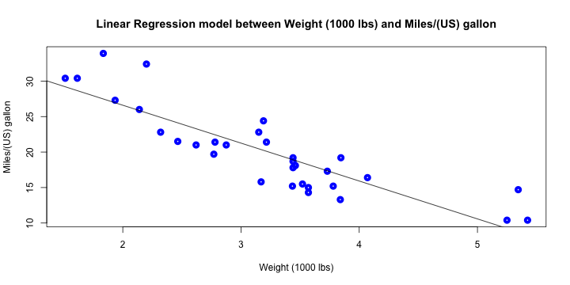

MyShinyApp
========================================================
author: Ray Cai
date: Sat Jan 23 15:59:05 2016

What
========================================================

This application uses dataset `mtcars` from library `dataset`, to build a single variable linear regression model, which fit $$y=\beta_0+\beta_1x$$

User could choose different `outcome` and `predictor`, to evaluate linear regression model.

The application will display the `intercept` and `slope`. And plot values and regression line on one plot.

How
========================================================

1. User choose the `outcome`
2. User choose the `predictor`
3. User click the button "Build model"

Available `outcome` and `predictor`:

```
 [1] "mpg"  "cyl"  "disp" "hp"   "drat" "wt"   "qsec" "vs"   "am"   "gear"
[11] "carb"
```

Example
========================================================
Suppose user choose `mpg` as `outcome`, `wt` as `predictor`. 

The application will display:
- $$\beta_0: 37.2851262$$
- $$\beta_1: -5.3444716$$


Example
========================================================
And display values and linear regression line on one plot:
 
